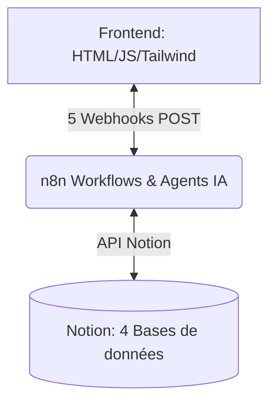

# 🕵️‍♂️ murderParty - Plateforme d'Enquête Assistée par IA

Bienvenue dans le projet **murderParty** ! Cette application est une interface moderne de type Single Page Application (SPA) connectée à **n8n** pour l'orchestration des agents IA et **Notion** pour le stockage persistant de l'état du jeu.

---

## 🛠️ Architecture de la Plateforme



---

## 💾 1. Configuration de Notion (Base de Données)

Pour vous éviter de créer les 4 tables et leurs relations à la main, un script d'initialisation automatique est fourni.

### ⚙️ Création Automatique via Script PowerShell
1. Créez une intégration Notion interne sur [developers.notion.com](https://developers.notion.com).
2. Créez une page Notion dans votre espace de travail et connectez-la à votre intégration (*Bouton `...` en haut à droite > Ajouter des connexions > Sélectionner votre intégration*).
3. Renseignez votre token Notion et l'ID de cette page dans le fichier `.env` à la racine du projet :
   ```env
   NOTION_TOKEN=secret_xxx...
   NOTION_PARENT_PAGE_ID=votre_page_id_32_caracteres
   ```
4. Exécutez le script PowerShell dans votre terminal pour générer instantanément les 4 tables reliées :
   ```powershell
   powershell -ExecutionPolicy Bypass -File setup_notion.ps1
   ```
5. Le script ajoutera automatiquement les IDs des bases de données créées à la fin de votre fichier `.env` :
   - `NOTION_DB_SCENARIOS`
   - `NOTION_DB_SESSIONS`
   - `NOTION_DB_CHARACTERS`
   - `NOTION_DB_CLUES`

*Ces IDs vous serviront dans n8n pour lire et écrire dans Notion.*

---

## 🤖 2. Les 5 Webhooks n8n Requis

Pour animer la partie, configurez vos workflows n8n pour écouter les endpoints suivants :

1. **`POST /webhook/generate-scenario`**
   - *Rôle :* Générer un pitch et une liste d'indices selon la thématique saisie par l'organisateur.
   - *Entrée :* `{ theme, pitch_global, organizer_email }`
   - *Notion :* Crée une entrée dans `[MP] Scenarios`.

2. **`POST /webhook/send-invitations`**
   - *Rôle :* Assigner aléatoirement les rôles (1 Coupable, 2 Faux-Coupables, 13 Innocents), calculer l'économie de points de départ de la session, et populer Notion.
   - *Entrée :* `{ scenario_id, session_name, date, location, emails }`
   - *Notion :* Crée une entrée dans `[MP] Sessions de Jeu` et les 16 entrées de `[MP] Personnages`.

3. **`POST /webhook/generate-avatar`**
   - *Rôle :* Générer un portrait IA (DALL-E, Stable Diffusion) et un marqueur visuel pour le joueur selon ses traits de caractère.
   - *Entrée :* `{ email, traits, photo_base64 }`
   - *Notion :* Met à jour le portrait et le marqueur dans `[MP] Personnages`.

4. **`POST /webhook/complete-mission`**
   - *Rôle :* Valider la réussite d'un objectif de joueur, lui attribuer des Points d'Action et rendre visible un indice caché.
   - *Entrée :* `{ email, mission_id, points_earned }`
   - *Notion :* Met à jour `[MP] Personnages` (PA) et débloque un indice dans `[MP] Indices et Lieux`.

5. **`POST /webhook/reveal-index`**
   - *Rôle :* Déduire 1 Point d'Action à un joueur s'il fouille une pièce et lui renvoyer les indices disponibles.
   - *Entrée :* `{ email, location_name }`
   - *Notion :* Déduit 1 PA dans `[MP] Personnages` et récupère les données de `[MP] Indices et Lieux`.

---

## 🌐 3. Lancement Local

1. Ouvrez simplement `index.html` dans votre navigateur.
2. Pour tester la simulation hors ligne sans n8n configuré, l'application utilise une simulation locale complète stockée dans le `localStorage` de votre navigateur.
3. Pour connecter l'application à vos vrais webhooks n8n, renseignez les adresses de vos webhooks n8n directement dans le code ou l'interface de paramétrage.
