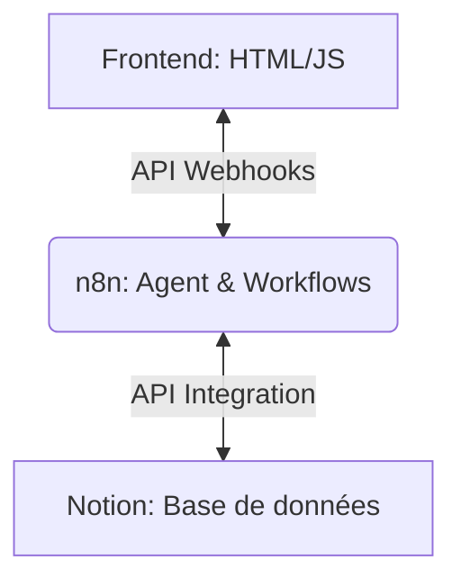

# 🕵️‍♂️ murderParty - Jeu d'Enquête Interactif

Bienvenue dans le projet **murderParty** ! Cette application est une interface moderne de tableau d'enquête (Investigation Board) connectée à **n8n** pour l'intelligence des suspects et **Notion** pour le stockage de l'état du jeu.

## 🛠️ Architecture du Projet



---

## 💾 1. Configuration de Notion (Base de Données)

Créez une page Notion contenant les bases de données suivantes :

### 📋 A. Table `Joueurs`
Stocke l'état et l'avancement de chaque joueur.
* **Nom** (Title) : Nom ou pseudonyme du joueur.
* **Rôle** (Select) : Détective, Complice, Témoin, etc.
* **Indices Trouvés** (Relation) : Lien vers la table `Indices`.
* **Statut** (Status) : En cours, Suspendu, Résolu.

### 🔍 B. Table `Indices`
Contient l'ensemble des indices découverts ou à découvrir.
* **Nom** (Title) : Nom de l'indice (ex: "Lettre déchirée").
* **Description** (Text) : Contenu ou détail de l'indice.
* **Trouvé** (Checkbox) : Coche si l'indice a été découvert.
* **Image URL** (URL) : Lien vers une image de l'indice.

### 🎭 C. Table `Suspects`
Définit les profils et secrets des suspects incarnés par les agents n8n.
* **Nom** (Title) : Nom du suspect (ex: "Inspecteur Adams").
* **Description** (Text) : Description physique ou rôle.
* **Alibi** (Text) : Son alibi officiel.
* **Secret** (Text) : Ce qu'il essaie de cacher (accessible uniquement à l'IA).
* **Instructions IA** (Text) : Directives système pour formater le comportement de l'agent n8n.

---

## 🤖 2. Configuration de n8n (Workflows & Agents)

Votre workflow n8n doit exposer deux Webhooks principaux pour communiquer avec le frontend :

### 💬 Webhook 1 : `/chat` (POST)
Permet de discuter avec un suspect IA.
* **Entrées attendues :**
  ```json
  {
    "suspectId": "Nom du Suspect",
    "message": "Votre question ici...",
    "playerId": "ID du Joueur"
  }
  ```
* **Logique n8n :**
  1. Requête dans la table Notion `Suspects` pour récupérer l'alibi, la bio et le secret du suspect.
  2. Appel à un nœud **Advanced AI Agent** utilisant le modèle de votre choix (OpenAI, Anthropic, Gemini, etc.).
  3. Fournir la bio et le secret dans le prompt système de l'agent.
  4. Répondre au webhook avec le message généré par le suspect.

### 🔑 Webhook 2 : `/inspect-code` (POST)
Permet de soumettre un code d'indice trouvé dans le monde réel ou le jeu.
* **Entrées attendues :**
  ```json
  {
    "code": "CODE123",
    "playerId": "ID du Joueur"
  }
  ```
* **Logique n8n :**
  1. Recherche du code dans la table Notion `Indices`.
  2. Si trouvé, cocher `Trouvé` à vrai et le lier au joueur.
  3. Retourner les détails de l'indice (nom, description, URL image) au frontend.

---

## 🌐 3. Lancement Local

1. Ouvrez simplement `index.html` dans votre navigateur.
2. Configurez l'URL de votre instance n8n dans l'interface ou modifiez la variable `N8N_WEBHOOK_URL` au début de `app.js`.
