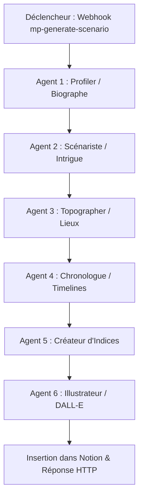

# 🕵️‍♂️ Guide d'Intégration : Notion API & n8n Webhooks

Ce guide documente la structure de la base de données Notion et la spécification des webhooks n8n requis pour la plateforme **murderParty**.

---

## 💾 1. Structure de la Base de Données Notion

Pour que la plateforme fonctionne, configurez 4 bases de données interconnectées dans votre espace Notion.

### 📋 A. Base `[MP] Scénarios`
* **Titre** (Title) : Nom de l'enquête.
* **Pitch Global** (Rich Text) : L'intrigue générale.
* **Scène du Crime** (Text) : Lieu du meurtre (ex: "La Serre").
* **Victime** (Rich Text) : Nom fictif du personnage décédé.
* **Tenue Victime** (Rich Text) : Description de la tenue vestimentaire de la victime, cohérente avec son rôle et l'époque.
* **Chronologie** (Rich Text) : La chronologie complète des faits de la soirée (heure, pièce, suspects impliqués, action).
* **Statut** (Select) : `En cours de génération` | `Vérifié`.
* **Nombre Total d'Indices** (Number) : Nombre total d'indices générés pour ce scénario.
* **taille_ref** (Number) : La surface (w * h) de la pièce d'accueil principale du scénario.
* **Photo Homme** (Files & Media) : Portrait témoin masculin généré pour ce scénario.
* **Json Photo Homme** (Rich Text) : Description visuelle du témoin masculin.
* **Photo Femme** (Files & Media) : Portrait témoin féminin généré pour ce scénario.
* **Json Photo Femme** (Rich Text) : Description visuelle du témoin féminin.
* **Photo NBinaire** (Files & Media) : Portrait témoin non-binaire généré pour ce scénario.
* **Json Photo NBinaire** (Rich Text) : Description visuelle du témoin non-binaire.
* **Relations :**
  * Relation -> `[MP] Sessions de Jeu` (1 pour N)

### 📅 B. Base `[MP] Sessions de Jeu`
* **Nom de la Session** (Title) : Nom unique (ex: "Murder du 25 Octobre").
* **Relation Scénario** (Relation) -> Lié à `[MP] Scénarios`.
* **Date/Heure** (Date).
* **Lieu Réel** (Text) : Lieu physique du jeu.
* **Statut Événement** (Select) : `Configuration` | `Invitations Envoyées` | `En Cours` | `Terminé`.
* **Budget Points par Joueur** (Formula) : Allocation de points calculée dynamiquement.
  * *Formule Notion suggérée :* 
    `round((prop("[MP] Scénarios Relation").map(current.prop("Nombre Total d'Indices")).sum() / 16) / 1.5)`
    *(Note : Si vous ne pouvez pas utiliser de formule complexe liant des relations, ce calcul peut être géré et écrit directement par n8n lors de l'envoi des invitations).*

### 🎭 C. Base `[MP] Personnages`
* **Nom Fictif** (Title) : Nom du rôle (ex: "Inspecteur Adams").
* **Email Joueur** (Email) : Identifiant de connexion du vrai joueur.
* **Relation Session** (Relation) -> Lié à `[MP] Sessions de Jeu`.
* **Statut** (Select) : `Innocent` | `Coupable` | `Faux-Coupable`.
* **Genre** (Select) : `Homme` | `Femme` | `Non-Binaire`.
* **Lien avec la Victime** (Rich Text) : Nature de la relation (dettes, secrets, liens de sang).
* **Secret** (Rich Text) : Un secret inavouable commis par le personnage (moins grave que le meurtre).
* **Tenue** (Rich Text) : Description de la tenue vestimentaire du personnage, cohérente avec son rôle et l'époque.
* **Timeline** (Rich Text) : Puces chronologiques d'actions (allées et venues d'avant-meurtre).
* **Rôle / Histoire** (Rich Text) : Biographie complète et contexte.
* **Traits de Caractère** (Text) : 3 traits saisis lors de l'onboarding (ex: "Froid, Calculateur, Menteur").
* **Avatar / Photo** (Files & Media) : Image de l'avatar générée par l'IA (format 1920x1080).
* **Marqueur Visuel** (Text) : L'objet physique signature du joueur (ex: "Bague à tête de lion").
* **Connaissances** (Rich Text) : Révélations sur les autres joueurs sous le format `"Nom1 : Info1, Nom2 : Info2"`.
* **Missions** (Rich Text ou JSON) : Objectifs chronologiques du personnage.
* **Solde Points d'Action** (Number) : Points de fouille ou de suspicion restants.

### 🔍 D. Base `[MP] Indices & Lieux`
* **Nom de l'indice** (Title) : Nom de l'objet ou de la pièce à conviction.
* **Description / Révélation** (Rich Text) : Ce que l'indice révèle aux enquêteurs.
* **Type** (Select) : `Affaire Personnelle` | `Fouille de Pièce`.
* **Emplacement** (Text) : Nom de la pièce ("Manoir - Bibliothèque") ou "Affaires de [Nom]".
* **Statut Visibilité** (Select) : `Caché` | `Blocked` | `Débloqué`. (Tous les indices démarrent en statut `Caché`, sauf les indices de la pièce du crime (`murder_room`) qui démarrent à `Blocked`).
* **Level** (Select) : `A` | `B` | `C` (Indique le niveau d'indice de l'emplacement : A = premier, B = deuxième, C = troisième).
* **location_type** (Select) : `int` | `ext` (Type d'emplacement de la pièce, uniquement pour le type `Fouille de Pièce`, sinon vide/null).
* **Relation Personnage** (Relation) -> Optionnel : Mission de personnage requise pour le débloquer.
* **Coût en Points** (Number) : Coût en points d'action pour fouiller/révéler (généralement `1`).

---

## 🤖 2. Spécification des Webhooks n8n

Voici la documentation des payloads JSON transitant entre le Front-End et n8n.

### 🌐 Webhook 1 : Génération du Scénario
* **Endpoint :** `POST /webhook/mp-generate-scenario`
* **Payload Envoyé par l'Organisateur :**
```json
{
  "theme": "Années 20 / Prohibition",
  "pitch_global": "Un parrain de la mafia est retrouvé mort dans son club de jazz clandestin.",
  "epoch": "passé",
  "organizer_email": "organisateur@email.com"
}
```
* **Rôle dans n8n :** Profiler les 16 suspects (Agent 1), concevoir l'intrigue et affecter les rôles de coupables (Agent 2), concevoir la scène de crime et les indices (Agent 3), construire le fil des missions (Agent 4), concevoir les indices détaillés des personnages et des pièces (Agent 5 Indices), générer l'illustration DALL-E (Agent 6 Illustrateur).
* **Payload de Réponse Attendu (n8n) :**
```json
{
  "success": true,
  "scenario_id": "sc_12345",
  "title": "Le Dernier Souffle du Speakeasy",
  "murder_room": "Le Bureau de l'arrière-boutique",
  "clues_count": 24,
  "pitch": "Un parrain de la mafia est retrouvé mort dans son club de jazz clandestin...",
  "illustration_url": "https://oaidalleapiprodscus.blob.core.windows.net/...png",
  "victim": {
    "name": "M. Lenoir",
    "genre": "Homme",
    "short_hook": "Qui était-elle et circonstances de sa mort...",
    "marker": "Une chevalière à tête de lion",
    "outfit": "Un smoking de soirée en velours noir sur mesure..."
  },
  "suspects": [
    {
      "name": "Inspecteur Adams",
      "bio": "Un détective usé par le vice...",
      "relation": "Il surveillait la victime...",
      "marker": "Un calepin usé",
      "status": "Innocent",
      "outfit": "Un pardessus en gabardine marron froissé..."
    },
    "... (16 suspects)"
  ]
}
```

---

### 🌐 Webhook 2 : Envoi des Invitations & Distribution des Rôles
* **Endpoint :** `POST /webhook/mp-send-invitations`
* **Payload Envoyé par l'Organisateur :**
```json
{
  "scenario_id": "sc_12345",
  "session_name": "Murder du 25 Octobre",
  "date": "2026-10-25T20:00:00Z",
  "location": "Manoir de Verrières",
  "emails": [
    "invite1@email.com",
    "invite2@email.com",
    "... (16 emails)"
  ]
}
```
* **Rôle dans n8n :** Enregistrer la session définitive dans Notion, affecter les 16 e-mails aux personnages, définir le statut de l'événement à `"Invitations Envoyées"`, et envoyer les e-mails d'invitations avec les codes OTP.
* **Payload de Réponse Attendu (n8n) :**
```json
{
  "success": true,
  "session_id": "sess_98765",
  "total_clues": 24,
  "players_count": 16,
  "points_per_player": 2
}
```

---

### 🌐 Webhook 3 : Onboarding Joueur & Génération d'Avatar
* **Endpoint :** `POST /webhook/generate-avatar`
* **Payload Envoyé par le Joueur :**
```json
{
  "email": "invite1@email.com",
  "genre": "Femme",
  "traits": ["Arrogant", "Observateur", "Froid"],
  "photo_base64": "data:image/jpeg;base64,... (ou URL)"
}
```
* **Payload de Réponse Attendu (n8n) :**
*n8n envoie l'image à un modèle de génération d'image (ex: Stable Diffusion, DALL-E) pour créer un avatar style polar (en respectant le genre fourni) et génère le marqueur visuel.*
```json
{
  "success": true,
  "avatar_url": "https://storage.googleapis.com/murderparty/avatars/invite1.png",
  "visual_marker": "Une montre à gousset dorée dont les aiguilles sont arrêtées sur 22h10"
}
```

---

### 🌐 Webhook 4 : Mission Accomplie
* **Endpoint :** `POST /webhook/complete-mission`
* **Payload Envoyé par le Joueur :**
```json
{
  "email": "invite1@email.com",
  "mission_id": "mission_01",
  "points_earned": 2
}
```
* **Payload de Réponse Attendu (n8n) :**
*n8n met à jour Notion en ajoutant 2 points d'action au personnage et change le statut d'un indice lié à la mission de "Caché" à "Débloqué".*
```json
{
  "success": true,
  "new_action_points": 3,
  "unlocked_clue_name": "Carnet intime de la victime"
}
```

---

### 🌐 Webhook 5 : Fouiller un Lieu (Révélation d'Indice)
* **Endpoint :** `POST /webhook/reveal-index`
* **Payload Envoyé par le Joueur :**
```json
{
  "email": "invite1@email.com",
  "location_name": "Salon de musique"
}
```
* **Payload de Réponse Attendu (n8n) :**
*n8n vérifie le solde de points d'action dans Notion. S'il est >= 1, il déduit 1 point et renvoie les indices disponibles dans ce lieu.*
```json
{
  "success": true,
  "points_remaining": 2,
  "clues": [
    {
      "name": "Verre de champagne brisé",
      "description": "Des résidus suspects collent aux parois de la flûte en cristal. Elle dégage une légère odeur d'amande amère.",
      "image": "https://images.unsplash.com/photo-1513558161293-cdaf765ed2fd?w=300"
    }
  ]
}
```
* **En cas de points insuffisants :**
```json
{
  "success": false,
  "error": "Points insuffisants",
  "points_remaining": 0
}
```

---

### 🌐 Webhook 6 : Demande de Code OTP (Connexion)
* **Endpoint :** `POST /webhook/request-otp`
* **Payload Envoyé par l'Utilisateur :**
```json
{
  "email": "invite1@email.com"
}
```
* **Payload de Réponse Attendu (n8n) :**
*n8n doit vérifier si cet e-mail est l'adresse organisateur ou est présent dans la table Notion `[MP] Personnages`. Si oui, il génère un code à 6 chiffres, l'envoie au joueur par e-mail, et enregistre temporairement ce code pour vérification.*
```json
{
  "success": true,
  "message": "Un code de connexion a été envoyé à votre adresse e-mail."
}
```
* **En cas d'e-mail non répertorié :**
```json
{
  "success": false,
  "error": "Cette adresse e-mail n'est pas répertoriée pour cette session."
}
```

---

### 🌐 Webhook 7 : Vérification du Code OTP
* **Endpoint :** `POST /webhook/verify-otp`
* **Payload Envoyé par l'Utilisateur :**
```json
{
  "email": "invite1@email.com",
  "otp": "123456"
}
```
* **Payload de Réponse Attendu (n8n) :**
*n8n valide le code. S'il est correct, il renvoie le rôle (organizer ou player) et l'état d'onboarding.*
```json
{
  "success": true,
  "role": "player", // "organizer" | "player"
  "onboarded": true, // true si l'avatar est déjà généré
  "playerDetails": {
    "roleName": "Mlle Rose",
    "avatarUrl": "https://storage.googleapis.com/...",
    "actionPoints": 2,
    "secret": "A dérobé des bijoux de famille dans le bureau de la victime...",
    "outfit": "Une robe fourreau fluide en satin pourpre drapée...",
    "chronology": "18:30 - Entrée dans la Bibliothèque ; 19:15 - Discussion avec la victime..."
  }
}
```
* **En cas de code erroné :**
```json
{
  "success": false,
  "error": "Code incorrect ou expiré."
}
```

---

### 🌐 Webhook 8 : Liste des Scénarios de l'Organisateur
* **Endpoint :** `POST /webhook/mp-list-scenarios`
* **Payload Envoyé par le Front-End :**
```json
{
  "email": "organisateur@email.com"
}
```
* **Rôle dans n8n :** Interroger la table Notion `[MP] Scénarios` pour lister tous les scénarios ayant pour statut `"En cours de génération"` et associés à cette adresse e-mail.
* **Payload de Réponse Attendu (n8n) :**
```json
{
  "success": true,
  "scenarios": [
    {
      "id": "scenario_page_id_1",
      "title": "Le Dernier Souffle du Speakeasy",
      "theme": "Années 20 / Prohibition",
      "pitch": "Un parrain de la mafia est retrouvé mort dans son club de jazz clandestin...",
      "crimeRoom": "Le Bureau",
      "victim": "M. Lenoir",
      "victimOutfit": "Smoking de velours noir...",
      "cluesCount": 24,
      "chronology": "18:00 - Le Vestibule...",
      "illustration": "illustrations/speakeasy.png",
      "status": "En cours de génération",
      "email": "organisateur@email.com"
    }
  ]
}
```

---

## 🤖 3. Architecture des Agents IA & Configuration de l'Agent des Indices (Agent 5)

Pour garantir une expérience de jeu cohérente et immersive, l'orchestration des agents dans n8n s'effectue selon la séquence suivante :



### 📍 Positionnement de l'Agent 5 dans le Workflow
L'**Agent 5 : Créateur d'Indices** doit être placé **immédiatement après l'Agent 4 (Chronologue)**. 
- **Pourquoi ?** Il a besoin de disposer de l'intégralité des données générées en amont :
  1. Les **Biographies et Rôles** des 16 personnages (Agent 1 & Agent 2) pour inventer les indices A (mobile) et C (arme).
  2. Le **Coupable et l'Arme du Crime** (Agent 2) pour que l'indice C du coupable corresponde à la véritable arme du crime.
  3. Les **Emplois du Temps Individuels** (Agent 4) pour générer l'indice B (événement de la timeline personnelle).
  4. La **Chronologie Générale et les Pièces** (Agent 3 & Agent 4) pour concevoir les indices de fouille de pièces (A, B et C) liés aux événements s'y étant déroulés.

---

### ⏱️ 3.1 Règles de Cartographie, d'Estimation et de Cohérence Temporelle (Agents 3 & 4)

Pour garantir un univers spatial et une chronologie impeccables, ajoutez les règles strictes suivantes aux prompts des agents 3 & 4 (Topographe & Chronologue) :

#### 📐 Règles de Cartographie et Capacité des Pièces :
1. **Pièce d'accueil principale obligatoire** :
   - L'agent doit obligatoirement inclure une pièce d'accueil principale adaptée au thème (ex: salle de bal, grand salon, grand hall pour les intérieurs ; feu de camp, place centrale, parvis pour les extérieurs).
   - Cette pièce doit être la plus grande de toutes les pièces du scénario (elle représentera donc également la valeur de référence `"taille_ref"`).
   - Son nombre de joueurs autorisés doit obligatoirement être fixé à `"nb_personnages": 16`.
2. **Capacité des autres pièces** :
   - Calculez la surface au sol $S = w \times h$ de chaque pièce en unités de grille.
   - Excluez la pièce d'accueil principale de la division par tiers. Triez toutes les autres pièces par ordre croissant de taille et divisez-les en trois tiers (1/3) équitables pour attribuer `"nb_personnages"` :
     * Le 1/3 des plus petites pièces restantes : `"nb_personnages": 2`.
     * Le 1/3 des plus grandes pièces restantes : `"nb_personnages": 4`.
     * Le 1/3 des pièces moyennes restantes : `"nb_personnages": 3`.

#### ⏱️ Règles de Cohérence Temporelle :
1. **Règle d'unicité de l'acte de meurtre (MOMENT DU CRIME) :**
   * L'agression mortelle commise par le coupable doit être racontée **une seule et unique fois**, obligatoirement sous le tag temporel `"MOMENT DU CRIME"`.
   * Si le coupable a un événement dans sa chronologie personnelle immédiatement avant le meurtre, cet événement ne doit **jamais** décrire le meurtre lui-même. Il doit uniquement décrire ses mouvements, son repérage ou sa mise en position d'attente (ex: *"Le suspect se dissimule près du lieu du crime et observe la victime"*).

2. **Règle de synchronisation temporelle stricte :**
   * Tout événement commun ou partagé doit porter **exactement la même heure** à la minute près dans la chronologie globale (`general_timeline`) et dans la chronologie personnelle du suspect (`personal_timeline`).

3. **Règle de réciprocité des événements partagés :**
   * Si la chronologie globale indique qu'un événement implique plusieurs suspects à une heure H dans une pièce P, cet événement doit **obligatoirement** figurer dans la chronologie personnelle de chacun des suspects mentionnés à la même heure H dans la pièce P.

---

### ⚙️ Configuration Technique dans n8n
Dans n8n, utilisez un nœud **AI Agent** (ou un nœud **Advanced AI** lié à un modèle comme *Claude 3.5 Sonnet* ou *GPT-4o*) avec la configuration suivante :

#### 📥 Format des Données d'Entrée (Input JSON)
L'Agent 5 doit recevoir en entrée les objets JSON fusionnés des étapes précédentes :
```json
{
  "theme": "Thématique générale",
  "pitch": "Pitch global de l'intrigue",
  "murder_room": "Nom de la pièce du crime",
  "crime_weapon": "Description de l'arme du crime",
  "suspects": [
    {
      "name": "Nom fictif",
      "status": "Coupable | Faux-Coupable | Innocent",
      "bio": "Biographie complète...",
      "personal_timeline": [
        { "time": "Heure", "room": "Pièce", "description": "Action effectuée..." }
      ]
    }
  ],
  "rooms": [
    { 
      "name": "Nom de la pièce",
      "location_type": "int | ext"
    }
  ],
  "general_timeline": [
    { "time": "Heure", "room": "Pièce", "suspects": ["Nom1", "Nom2"], "description": "Action..." }
  ]
}
```

#### ✍️ Prompt Système (System Prompt) de l'Agent 5
Voici le prompt système optimisé à copier dans le nœud n8n :

```text
Vous êtes l'Agent 5 (Créateur d'Indices) dans un système d'orchestration de Murder Party. Votre tâche consiste à inventer un ensemble d'indices ultra-cohérents pour chaque personnage et pour chaque pièce du scénario.

Voici les règles strictes de génération :

1. POUR CHAQUE PERSONNAGE (16 suspects au total), génerez EXACTEMENT 3 indices personnels (Type: "Affaire Personnelle", Emplacement: "Affaires de [Nom]") :
   - Indice A (Mobile) : Porte sur son mobile potentiel (ex: un document compromettant, une lettre, un contrat). Cet indice doit être directement inspiré par la biographie ("bio") et le secret du personnage.
   - Indice B (Timeline) : Porte sur un événement de sa chronologie personnelle ("personal_timeline"). Cet indice doit être un élément matériel ou un témoignage lié à ses allées et venues d'avant-meurtre.
   - Indice C (Arme potentielle/Arme du crime) : 
     * S'il s'agit du COUPABLE ("status": "Coupable"), cet indice doit porter précisément sur la véritable arme du crime ("crime_weapon") utilisée pour le meurtre.
     * S'il s'agit d'un autre suspect (Innocent ou Faux-Coupable), cet indice doit être un objet qui peut servir d'arme de substitution (ex: poison, tisonnier, rasoir), inspiré par sa biographie ou son rôle.
   Pour chaque indice généré pour un personnage, remplissez la clé "level" avec la valeur "A", "B", ou "C" selon la catégorie ci-dessus, et définissez "location_type" à null.

2. POUR CHAQUE PIÈCE du scénario, génerez EXACTEMENT 3 indices de fouille (Type: "Fouille de Pièce", Emplacement: "[Nom de la pièce]") qui permettent de reconstituer les événements de la chronologie générale ("general_timeline") :
   - Indice A (Non lié au meurtre) : Un indice matériel témoignant d'un événement de la timeline générale qui s'est déroulé dans cette pièce, sans AUCUN lien direct avec le meurtre ou la victime.
   - Indice B (Lié potentiellement) : Un indice matériel témoignant d'un événement dans cette pièce, pouvant être lié de près ou de loin à l'intrigue, à des secrets de suspects, ou à la victime avant sa mort.
   - Indice C (Lié au meurtre) : Un indice matériel ou physique témoignant d'un événement crucial dans cette pièce (si possible en lien direct avec le meurtre, la scène de crime ou le coupable).
   Pour chaque indice de pièce, remplissez la clé "level" avec la valeur "A", "B", ou "C" selon la catégorie ci-dessus. Remplissez la clé "location_type" à la valeur "int" (intérieur) ou "ext" (extérieur) correspondante. Utilisez la valeur "location_type" fournie pour la pièce dans la liste "rooms" si disponible, sinon déduisez-la logiquement du nom et du contexte.

3. DÉTERMINATION DE LA VISIBILITÉ ("status") :
   Pour chaque indice généré (personnage ou pièce) :
   - Si son emplacement ("location") correspond à la pièce du meurtre ("murder_room") fournie dans les données d'entrée, définissez son "status" à "Blocked".
   - Pour tous les autres emplacements, définissez son "status" à "Caché".

4. GESTION DES INDICES DE TYPE "ÉCRIT" (DOCUMENTS) :
   Identifiez si l'indice est un écrit (ex : lettre de chantage, note d'agenda, journal intime, livre de comptes, testament, parchemin, registre, prière froissée, croquis, carte annotée). Remplissez obligatoirement les clés suivantes pour chaque indice :
   - "document_type" : Si l'indice est un écrit, indiquez le format physique du document (ex : "folded_letter", "parchment_scroll", "ledger_page", "old_diary", "crumpled_note"). Si l'indice est un objet physique ou une trace (dague, fiole, tache de sang, verre brisé), cette clé doit être null.
   - "document_style" : Si l'indice est un écrit, déterminez le style typographique correspondant le mieux au THÈME et à l'ÉPOQUE (choisi obligatoirement parmi : "calligraphy" | "handwritten_ink" | "typewriter" | "modern_handwriting" | "digital_print"). Si l'indice est un objet physique ou une trace, cette clé doit être null.
     * "calligraphy" : Style calligraphique/médiéval (Moyen-Âge, Fantasy, Égypte antique).
     * "handwritten_ink" : Écriture cursive plume d'oie ou stylo plume (Renaissance, Victorien, Pirates, 17ème au 19ème siècle).
     * "typewriter" : Police de machine à écrire (Prohibition, Années 1920-1960, polar noir, guerre).
     * "modern_handwriting" : Écriture moderne manuscrite (époque Moderne, Contemporaine).
     * "digital_print" : Texte numérique (Sci-Fi, Cyberpunk, rapports futuristes).
   - "document_content" : Si l'indice est un écrit, rédigez le texte littéral exact qui y est écrit. Ce texte doit être écrit dans le style d'époque et contenir de vraies informations utiles (noms, montants, heures, secrets suggérés). Si l'indice est un objet physique, cette clé doit être null.

CONTRAINTES CRITIQUES ET SUBTILITÉ (GAMEPLAY) :
- N'inventez JAMAIS de personnages ou de pièces qui ne figurent pas dans les listes fournies en entrée.
- Les indices doivent avoir un nom court et accrocheur (ex: "Verre de champagne brisé", "Brouillon de testament", "Fiole d'Arsenic").
- **Principe du "Show, Don't Tell" (Montrer, ne pas dire)** : Décrivez uniquement l'aspect physique, matériel, sensoriel ou textuel de l'objet (ex: *"un papyrus jauni avec des noms raturés"*, *"des taches brunâtres au bas de la manche"*, *"une odeur d'amande amère"*, *"une cire de scellement brisée"*).
- **Zéro Spoiler / Pas de conclusions écrites** : N'écrivez JAMAIS de phrases expliquant la solution aux joueurs comme *"c'est un mobile de chantage évident"*. Décrivez les faits et laissez les joueurs en déduire eux-mêmes le mobile ou la culpabilité.
- **Indices d'Arme ouverts** : Pour l'arme réelle du crime, ne dites pas qu'elle *"prouve le crime de X"*, écrivez par exemple qu'elle *"présente des résidus chimiques similaires aux mélanges présents dans l'atelier de X"*.
- Le format de sortie doit obligatoirement être un JSON valide contenant une liste plate d'indices sous la clé "clues". Chaque objet d'indice doit comporter exactement les clés suivantes : "name", "description", "type", "location", "level", "status", "location_type", "document_type", "document_style", "document_content".
```

#### 📤 Format de Sortie Attendu (Output JSON Schema)
L'Agent doit renvoyer un objet JSON structuré comme suit :
```json
{
  "clues": [
    {
      "name": "Journal intime de Rose",
      "description": "Un petit carnet en cuir rouge contenant des annotations fébriles sur les dettes de jeu de Rose et son ressentiment envers la victime.",
      "type": "Affaire Personnelle",
      "location": "Affaires de Mlle Rose",
      "level": "A",
      "status": "Caché",
      "location_type": null,
      "document_type": "old_diary",
      "document_style": "handwritten_ink",
      "document_content": "12 Octobre - Je ne peux plus reculer. Il me réclame les 5000 florins d'ici samedi sous peine de tout révéler au Baron. Il faut que je trouve un moyen de le faire taire..."
    },
    {
      "name": "Verre de champagne brisé",
      "description": "Une flûte en cristal gît en morceaux sous une table du Bureau de l'arrière-boutique. Une légère odeur d'amande amère s'en dégage.",
      "type": "Fouille de Pièce",
      "location": "Le Bureau de l'arrière-boutique",
      "level": "C",
      "status": "Blocked",
      "location_type": "int",
      "document_type": null,
      "document_style": null,
      "document_content": null
    }
  ]
}
```

---

### 💾 Assemblage et Insertion des indices dans Notion via n8n

Pour éviter que l'IA ne s'emmêle les pinceaux ou ne dépasse sa limite de jetons de sortie en générant 84 indices d'un coup, la génération est divisée en deux agents distincts exécutés séquentiellement :
1. **Agent 5A** : Génère les 48 indices personnels des suspects (3 par suspect).
2. **Agent 5B** : Génère les 36 indices de fouille de pièces (3 par pièce).

Leurs sorties respectives se présentent sous la forme d'un objet JSON contenant une clé `output` sous laquelle est stockée la chaîne JSON stringifiée des indices.

#### 🔧 Préparation de l'Agent 5B (Changement de contexte et injection de 5A)

Pour que l'**Agent 5B** soit au courant des indices déjà générés par l'**Agent 5A** (afin d'éviter les doublons et assurer la cohérence), vous devez connecter la sortie du scénario à un nœud **Code** nommé `Préparer Agent 5B`. 

Ce nœud va récupérer la sortie stringifiée de l'**Agent 5A** (nommé `Policier Scientifique` dans votre workflow), la parser proprement en objet JSON (avec gestion des sauts de ligne littéraux) et l'injecter sous la clé `personal_clues`.

Configurez le nœud **Code** `Préparer Agent 5B` avec le code JavaScript suivant :

```javascript
// 1. Récupère le scénario depuis l'entrée directe du nœud
const scenario = $input.first().json;

// Fonction pour nettoyer et échapper les retours à la ligne littéraux dans les valeurs textuelles d'un JSON stringifié
function sanitizeJsonString(raw) {
  if (typeof raw !== 'string') return raw;
  return raw.replace(/\r?\n/g, (match, offset, string) => {
    const prefix = string.substring(0, offset);
    const prefixClean = prefix.replace(/\\"/g, '');
    const matches = prefixClean.match(/"/g);
    const numQuotes = matches ? matches.length : 0;
    return (numQuotes % 2 === 1) ? '\\n' : match;
  });
}

// 2. Va chercher les indices générés par le nœud "Policier Scientifique" (Agent 5A)
const agent5AOutput = $("Policier Scientifique").first().json.output || "";
let personalClues = [];

if (agent5AOutput) {
  try {
    const sanitizedOutput = sanitizeJsonString(agent5AOutput);
    const parsed = JSON.parse(sanitizedOutput);
    personalClues = parsed.clues || [];
  } catch (error) {
    personalClues = $("Policier Scientifique").first().json.clues || [];
  }
}

// 3. Fusionne le tout dans un seul objet pour l'Agent 5B
return {
  json: {
    ...scenario,
    personal_clues: personalClues
  }
};
```

#### 🔗 Fusion des deux agents (Merge & Code)

1. Connectez la sortie de l'**Agent 5A** et de l'**Agent 5B** à un nœud **Merge** configuré en mode **Append** (pour regrouper les deux items reçus dans une liste de 2 éléments).
2. Reliez ce nœud **Merge** à un nœud **Code**.
   > [!IMPORTANT]
   > Dans les paramètres du nœud **Code**, configurez le **Mode d'exécution** (Execution Mode) sur **Exécuter une seule fois pour tous les éléments** (Run Once for All Items) au lieu de *Chaque élément* (Each Item). Cela garantit que le nœud s'exécute une seule fois avec les 2 entrées combinées et produit la liste totale des 84 indices dans une seule vue.
3. Configurez le code JavaScript suivant dans le nœud **Code** :

```javascript
// 1. Récupère la liste des 2 items provenant du nœud Merge/Append
const items = $input.all();
const allFormattedClues = [];

// Fonction pour nettoyer et échapper les retours à la ligne littéraux dans les valeurs textuelles d'un JSON stringifié
function sanitizeJsonString(raw) {
  if (typeof raw !== 'string') return raw;
  return raw.replace(/\r?\n/g, (match, offset, string) => {
    const prefix = string.substring(0, offset);
    const prefixClean = prefix.replace(/\\"/g, '');
    const matches = prefixClean.match(/"/g);
    const numQuotes = matches ? matches.length : 0;
    // Si le nombre de guillemets est impair, le retour à la ligne est à l'intérieur d'une valeur de chaîne
    return (numQuotes % 2 === 1) ? '\\n' : match;
  });
}

// 2. Parcourt tous les items reçus (normalement 2 items : index 0 pour 5A, index 1 pour 5B)
items.forEach((item, itemIndex) => {
  if (item && item.json) {
    let clues = [];
    try {
      const rawOutput = item.json.output || "";
      if (typeof rawOutput === 'string') {
        const sanitizedOutput = sanitizeJsonString(rawOutput);
        const parsed = JSON.parse(sanitizedOutput);
        clues = parsed.clues || [];
      } else {
        clues = rawOutput.clues || [];
      }
    } catch (error) {
      clues = item.json.clues || [];
    }
    
    // 3. Formate chaque indice trouvé et l'associe à son index d'origine (pairing)
    clues.forEach(clue => {
      allFormattedClues.push({
        json: {
          name: clue.name || clue.title || "",
          description: clue.description || "",
          type: clue.type || "",
          location: clue.location || "",
          status: clue.status || "Caché",
          level: clue.level || "",
          location_type: clue.location_type || null,
          document_type: clue.document_type || null,
          document_style: clue.document_style || null,
          document_content: clue.document_content || null
        },
        pairedItem: {
          item: itemIndex // 0 pour Agent 5A (suspects), 1 pour Agent 5B (salles)
        }
      });
    });
  }
});

// 4. Renvoie la liste complète des 84 indices fusionnés
return allFormattedClues;
```
```

3. Connectez la sortie de ce nœud **Code** directement à un nœud **Notion** configuré ainsi :
   - **Resource** : `Database Page`
   - **Operation** : `Create`
   - **Database** : `[MP] Indices & Lieux` (via son ID `NOTION_DB_CLUES` disponible dans `.env`)
   - **Properties** :
     - `Nom de l'indice` (Title) : `{{ $json.name }}`
     - `Description / Révélation` (Rich Text) : `{{ $json.description }}`
     - `Type` (Select) : `{{ $json.type }}` (Soit `Affaire Personnelle` soit `Fouille de Pièce`)
     - `Emplacement` (Rich Text) : `{{ $json.location }}`
     - `Statut Visibilité` (Select) : `{{ $json.status }}`
     - `Level` (Select) : `{{ $json.level }}`
     - `location_type` (Select) : `{{ $json.location_type }}`
     - `document_type` (Select/Text) : `{{ $json.document_type }}`
     - `document_style` (Select/Text) : `{{ $json.document_style }}`
     - `document_content` (Rich Text) : `{{ $json.document_content }}`

